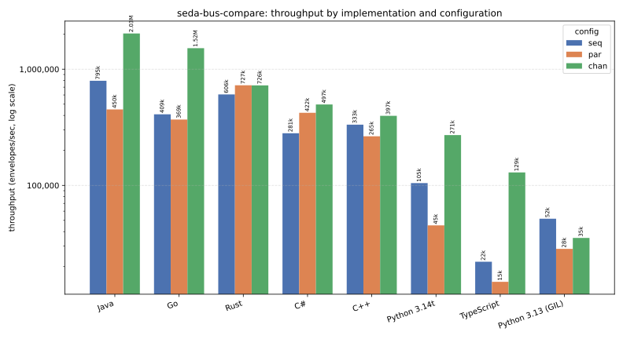
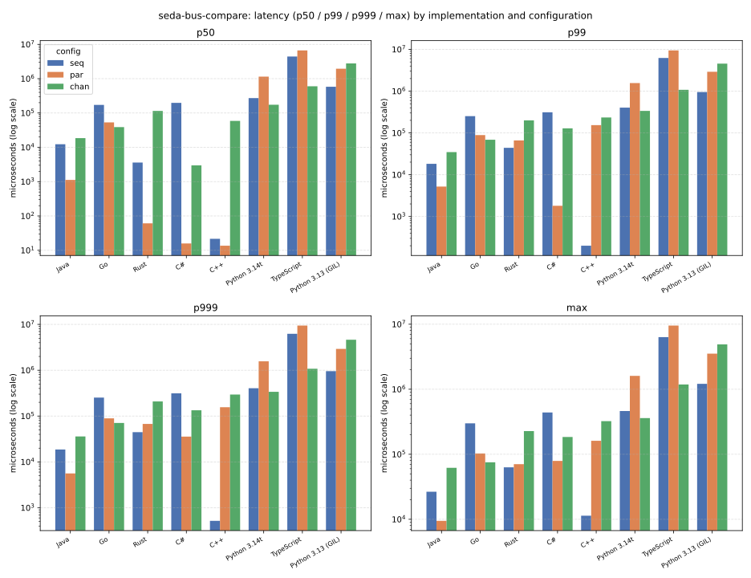

<div align="center">
  <h1>seda-bus-compare</h1>
  <p><strong>Resolving Architecture &mdash; Clarity in Design</strong></p>
  <p>A cross-language comparison of the seven <a href="../">seda-bus</a> implementations.</p>
</div>

`seda-bus` — a small, broker-less, staged message bus — exists in seven
language ports: Java, Rust, Python, TypeScript, C++, C#, and Go, all built
from [one shared design](https://github.com/resolvingarchitecture/seda-bus-design). This repo compares them: the same
benchmark workload, run identically in all seven, plus a table of the
structural differences already documented per-port (worker pool model,
dependencies, envelope source, and more).

- **[`METHODOLOGY.md`](METHODOLOGY.md)** — what's measured, how, and — just
  as important — what it doesn't mean. Read this before the numbers.
- **[`RESULTS.md`](RESULTS.md)** — the full numbers and narrative.
- **[`bench/WORKLOAD.md`](bench/WORKLOAD.md)** — the benchmark specification
  every `bench/<lang>` program implements identically.

## Results at a glance

Full narrative in [`RESULTS.md`](RESULTS.md); read
[`METHODOLOGY.md`](METHODOLOGY.md) first — this report has been
substantially corrected twice by direct, specific pushback (a contaminated
host, then envelope construction cost silently folded into every "bus
overhead" number), and this pass went further and fixed four real bugs in
the libraries it measures (Go, Rust — two separate fixes, C++ — see "What
this found" below), so these are directional, not authoritative. `seq` = 1 producer/1 channel;
`par` = 8 producers sharing 1 channel (lock contention); `chan` = 8
producers, 8 independent channels (real parallel capacity). 200,000
envelopes/trial, 3 trials/config, envelope construction excluded from the
timed window, all numbers envelopes/sec.

| Implementation                | seq     | par     | par vs. seq |          chan | chan vs. seq |
|--------------------------------|--------:|--------:|------------:|--------------:|-------------:|
| Java                           | 970,273 | 505,126 |       0.52x | **1,973,541** |        2.03x |
| Go                             | 370,802 | 392,855 |       1.06x |     1,543,265 |        4.16x |
| Rust                           | 576,594 | **709,629** |   **1.23x** |       729,021 |        1.26x |
| C#                             | 273,883 | 272,370 |       0.99x |       396,465 |        1.45x |
| C++                            | 323,133 | 259,425 |       0.80x |       386,556 |        1.20x |
| Python 3.14t (free-threaded)   | 102,589 |  45,178 |       0.44x |       274,172 |        2.67x |
| TypeScript (Node 22)           |  21,547 |  14,457 |       0.67x |       128,621 |    **5.97x** |
| Python 3.13 (GIL)              |  48,206 |  30,131 |       0.63x |        35,502 |    **0.74x** |



Rust moved the most here, and not from a methodology change — from a real
fix: `Channel`'s single data-queue mutex (shared by every producer *and*
consumer on a stage) was replaced with `crossbeam-queue`'s lock-free
`ArrayQueue`, taking `par` from 427,650 to 709,629 eps (+66%) — `par` now
*beats* `seq` (1.23x) and nearly matches `chan`. C++ also moved
substantially, from its own real fix: `Channel`'s single mutex was
replaced with a two-lock ring-buffer queue, nearly doubling `seq` and more
than tripling `par`. C++'s `par` is no longer this report's worst collapse
(0.80x now, was 0.39x). See "What this found" below.

Latency (`p50`/`p99`/`p999`/`max`, microseconds) tells a different story —
it's queueing delay under a producer/consumer rate mismatch, not raw
dispatch cost (`bench/WORKLOAD.md` explains why). **This pass's central
finding: once producers aren't artificially throttled by construction
cost, several "compiled, natively-multithreaded" implementations show a
real, sustained backlog, including in `chan`** — the configuration this
report previously held up as having no artificial contention point left to
hide behind. That overturns this report's own earlier claim that compiled
languages never show this pattern. See `RESULTS.md`'s "Latency" section for
the full clean/tail-stall/backlog classification, table, and per-language
detail — it's long, and worth reading in full rather than summarized here.

| Implementation    | Config |         p50 (us) |       p99 (us) |      p999 (us) |       max (us) |
|-------------------|--------|------------------:|----------------:|----------------:|----------------:|
| Java               | seq    |          16,311.5 |         19,314.4 |         19,424.5 |         29,395.8 |
| Java               | par    |             667.6 |          4,331.2 |          4,758.3 |          6,559.8 |
| Java               | chan   |          12,991.6 |         30,192.6 |         31,473.7 |         35,382.4 |
| Go                 | seq    |         248,313.4 |        303,660.6 |        304,835.6 |        359,600.8 |
| Go                 | par    |          64,284.0 |        101,024.2 |        101,345.2 |        123,354.5 |
| Go                 | chan   |          49,053.6 |         82,153.3 |         86,180.8 |         91,737.4 |
| Rust               | seq    |           5,473.7 |         10,047.8 |         10,216.1 |         26,303.1 |
| Rust               | par    |          95,678.8 |        163,316.4 |        163,988.2 |        170,084.2 |
| Rust               | chan   |          89,832.5 |        179,564.3 |        186,023.2 |        198,074.0 |
| C#                 | seq    |         211,531.6 |        306,045.4 |        306,326.0 |        462,126.0 |
| C#                 | par    |              18.2 |         22,400.8 |         51,804.2 |         78,553.8 |
| C#                 | chan   |           3,701.5 |        206,094.4 |        218,437.2 |        234,820.4 |
| C++                | seq    |           6,321.4 |         14,691.9 |         15,253.9 |         39,798.2 |
| C++                | par    |           9,714.6 |        146,138.6 |        148,557.4 |        205,465.0 |
| C++                | chan   |          78,511.3 |        368,954.9 |        372,643.4 |        383,369.1 |
| Python 3.14t       | seq    |         326,637.3 |        447,365.4 |        449,672.5 |        473,971.0 |
| Python 3.14t       | par    |       1,154,405.5 |      1,619,838.3 |      1,624,483.7 |      1,684,543.7 |
| Python 3.14t       | chan   |         207,261.3 |        339,872.4 |        342,219.7 |        373,012.9 |
| TypeScript         | seq    |       4,433,258.8 |      6,238,324.6 |      6,243,100.2 |      6,289,775.2 |
| TypeScript         | par    |       6,660,340.8 |      9,558,982.3 |      9,567,778.4 |      9,603,268.9 |
| TypeScript         | chan   |         595,209.5 |      1,015,910.0 |      1,017,284.6 |      1,038,776.2 |
| Python 3.13 (GIL)  | seq    |         555,618.0 |        990,808.0 |        999,983.9 |      1,139,307.1 |
| Python 3.13 (GIL)  | par    |       2,775,020.5 |      3,656,896.5 |      3,676,550.4 |      3,969,731.3 |
| Python 3.13 (GIL)  | chan   |       2,876,805.7 |      4,472,102.1 |      4,587,300.0 |      5,001,011.7 |



C++'s `seq` and Rust's `seq` are the only genuinely clean cases now
(consumer always keeps pace); both `par`s moved from "clean, mild tail" /
"a rare severe cliff" to "mild backlog" / "real, sustained backlog" as a
direct, expected consequence of each fix actually working (more real
throughput means a bigger average queue depth, by Little's law — not a
new problem). Everything else shows at least a tail-only stall, and most
show a real, sustained backlog once a fast-enough producer can outrun its
consumer. Rust's `seq` tail stall and `par`'s separate lock-contention
cliff are both fixed this pass (see "What this found" below). `chan`'s
real backlog in Rust is fully root-caused, not just explained: it's
genuine thread-count oversubscription (8 channels need 16 threads; this
benchmark host has 12 cores), confirmed by directly testing and ruling out
two other hypotheses first, with a measured recovery curve as channel
count drops toward the core budget — see `RESULTS.md`'s "Thread/channel
count must stay within the host's core budget." Full detail in
`RESULTS.md`, including an "Every anomaly, explained" section walking
through each surprising number in both tables above individually, and a
"Fixes applied this pass" section covering all four real fixes (and one
reverted attempt) in full.

## Reproducing this

Requires Docker and the sibling repos checked out at the standard monorepo
layout (`setup.sh` verifies this, and can clone them for you):

```sh
./setup.sh                     # verify (or SETUP_CLONE=1 ./setup.sh to clone) sibling repos
./scripts/build_and_run.sh     # build all 8 images (7 languages + Python's
                                # free-threaded variant), run each, write
                                # results/raw/<lang>.jsonl
python3 scripts/aggregate.py   # write results/summary.csv, print the RESULTS.md tables
python3 scripts/plot_charts.py # write results/charts/{throughput,latency}.svg (needs matplotlib)
```

Every language builds inside its own Docker container with a pinned base
image — see `bench/<lang>/Dockerfile` — so results don't depend on whatever
happens to already be installed on the machine running this. See
`METHODOLOGY.md` for why that matters here specifically (none of
`ra-common-*`/`seda-bus-*` are published to a package registry). Verify the
Docker Desktop VM is actually idle before trusting a run — `docker ps -q`
showing zero containers is not sufficient on its own; see `RESULTS.md`'s
"A note on host quietness" for what caught this pass's host contamination
and how it was confirmed resolved.

## Structure

```
bench/
  WORKLOAD.md       the shared benchmark specification
  <lang>/           one program per language, same logic, reading the spec
    Dockerfile      pinned toolchain, builds against the sibling ra-common-*/seda-bus-*
results/
  raw/<lang>.jsonl  one JSON object per trial (see WORKLOAD.md's output contract)
  summary.csv       aggregated by scripts/aggregate.py
  charts/*.svg      throughput/latency charts, generated by scripts/plot_charts.py
scripts/
  build_and_run.sh  builds + runs every bench/<lang> image
  aggregate.py      raw/*.jsonl -> summary.csv + the RESULTS.md tables
  plot_charts.py    summary.csv -> results/charts/*.svg
setup.sh            verifies/clones the sibling repos this depends on
```

## What this found

Building this surfaced three real C++ construction-time bugs, two real
methodology failures, and — this pass — four real bugs/design issues
found and **fixed in the actual libraries**, not just measured:

- **`seda-bus-go` had a genuine lost-wakeup race**: `schedule()` gave up
  silently when it couldn't get a bus-wide permit, with no guarantee
  anything would ever retry a starved channel — exactly the mechanism
  behind this report's intermittent `chan` drain failures across two
  sessions. Fixed; verified with `go test -race` and 10 consecutive clean
  full-suite runs.
- **`seda-bus-rust`'s `seq` cold-wake stall** (worst case up to 260ms) is
  fixed by swapping the pool's job queue to `parking_lot` — a smaller,
  better-understood cost (~4.6% `par` throughput) than an earlier,
  reverted `crossbeam-channel` attempt (~15-20%).
- **`seda-bus-rust`'s `par` lock-contention cliff** (`p50` ~38us, `p99`
  ~70,000us — a ~1,800x jump) is a separate mechanism from the `seq` stall
  above (the channel's data queue, not the pool's job queue) and is fixed
  by swapping `Mutex<VecDeque<Envelope>>` for `crossbeam-queue`'s
  lock-free, bounded `ArrayQueue`: `par` throughput 427,650 → 709,629 eps
  (+66%), now beating `seq` and nearly matching `chan`. A first attempt
  regressed `seq` ~14x (an unconditional lock touch on every `poll()`,
  even with nothing waiting); fixed with an atomic waiter-count gate.
- **`seda-bus-cpp`'s single-mutex `Channel`** — this report's worst
  throughput collapse (`par` 0.39x) for three passes running — is fixed
  with a two-lock ring-buffer queue: `seq` nearly doubled, `par` more than
  tripled. A first attempt (a linked-list two-lock queue) fixed `par` but
  broke `seq`; verified clean under ThreadSanitizer in Docker after the
  fix.
- **A matching attempt on `seda-bus-cs` made things worse and was
  reverted** — not shipped as a partial win. See `RESULTS.md`'s "Fixes
  applied this pass" for the full investigation on all five, including why
  the C# one didn't work.

Separately, still true from earlier passes: envelope *construction* was
folded into every "bus overhead" number in this report until a direct,
specific challenge caught it (*"we're not measuring the ability of this
code to create an Envelope"*) — fixing that reshuffled the throughput
ranking (Java leads, not Rust) and overturned this report's own standing
claim that compiled languages never show backlog under `seq`/`par`/`chan`.
The benchmark's `par` config measures lock contention, not parallel
capacity, and `chan` was added specifically to answer "does parallelism
actually work here" — it does, substantially, for every implementation
except GIL-bound Python. The first full run also reported Rust's `par` as
flat due to a contaminated host; caught by direct pushback, fixed by
rerunning with nothing else executing. See `METHODOLOGY.md` and
`RESULTS.md`'s "Latency" section for both stories in full.

C++'s first run was 20-30x slower than Rust for identical work, traced to
three real bugs in `ra-common-cpp`'s random-byte/route-clone construction
path (commits `8700729`, `7e5717b`, `1b3f687`) — all genuine fixes, but all
construction-time costs that this benchmark's timed window no longer
includes by design, so their dramatic before/after numbers are preserved
as history in `RESULTS.md`, not reproducible on this page anymore.

`seda-bus-rust` was the one port never built on `ra-common` until an
earlier pass rewired it onto `ra_common::Envelope` and measured a real
throughput cost from doing so. That conclusion is still revisited, not
settled: this pass's construction-excluded `seq` throughput (576,594 eps)
is *higher* than the old pre-rewire, construction-inclusive number
(469,164) — hard to reconcile with "the rewire has an ongoing dispatch-time
cost." The likely correct reading is that most of the previously-measured
cost was construction cost, now properly excluded, not a genuine
per-envelope dispatch tax — flagged as needing a fresh A/B test to
confirm, not asserted as settled. Separately, `par`'s lock-contention
cliff (fixed this pass, above) was never a consequence of the rewire
either — it's a channel data-queue bottleneck unrelated to which envelope
type the bus carries. See `RESULTS.md`'s "Rust: the `ra-common` rewire,
revisited" section.
